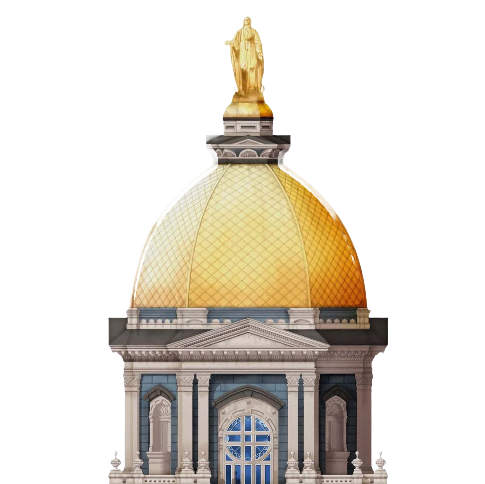

<!-- PROJECT LOGO -->

 

  

<h3 align="center">ND AIMM Repository</h3>

    By: The Notre Dame Artifical Intelligence Team
     
    <a href="https://starlight-traveler.github.io/nd-aimm-main-computer/README.html"><strong>Explore the docs »</strong></a>
     
     
    <a href="https://github.com/starlight-traveler/nd-aimm-main-computer/issues/new?labels=bug&template=bug-report---.md">Report Bug</a>
    ·
    <a href="https://github.com/starlight-traveler/nd-aimm-main-computer/issues/new?labels=enhancement&template=feature-request---.md">Request Feature</a>
  

<!-- TABLE OF CONTENTS 

## Getting Started

Please review the getting started documentation at [Getting Started](https://starlight-traveler.github.io/nd-aimm-main-computer/README.html).

<!--Assignments -->

## Assignments

See the [open issues](https://github.com/starlight-traveler/nd-aimm-main-computer/issues) for a full list of proposed features (and known issues).

(<a href="#readme-top">back to top</a>)

<!-- CONTRIBUTING -->

## Contributing

Contributions are key to this project to learn, inspire, and create. Any contributions you make are **greatly appreciated**.

Please review the guidelines at [Code Contributions](https://starlight-traveler.github.io/nd-aimm-main-computer/README.html) before adding anything to the project.

If you have a suggestion that would make this better, please fork the repo and create a pull request.

In case you forgot...

1. Fork the Project
2. Create your branch
3. Commit your changes
4. Push to the branch
5. Open a pull request

(<a href="#readme-top">back to top</a>)

<!-- LICENSE -->

## License

Distributed under the MIT License. See `LICENSE.txt` for more information.

(<a href="#readme-top">back to top</a>)

